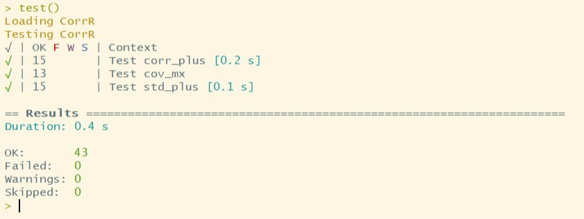

[](https://travis-ci.org/UBC-MDS/CorrR)

# CorrR

Latest Update Date: 2019 Feb.

# Overview

This project is developed to help users calculate standard deviation, correlation coefficients and covariance matrix of a given data with missing values in both R and Python.

- [Python Version Link](https://github.com/UBC-MDS/CorrPy)
- [R Version Link](https://github.com/UBC-MDS/CorrR)

# Team

| Name  | Slack Handle | Github.com | Project branch |
| :------: | :---: | :----------: | :---: |
| KERA YUCEL | `@KERA YUCEL` | [`@K3ra-y`](https://github.com/K3ra-y) | [Kera's link](https://github.com/UBC-MDS/CorrR/tree/Kera)|
| GOPALAKRISHNAN ANDIVEL | `@Krish` | [`@Gopsathvik`](https://github.com/GopsathvikM) | [Krish's link](https://github.com/UBC-MDS/CorrR/tree/krish)|
| WEISHUN DENG | `@Wilson Deng` | [`@xiaoweideng`](https://github.com/xiaoweideng) | [Wilson's link](https://github.com/UBC-MDS/CorrR/tree/wilso)|
| Mengda Yu | `@Mengda(Albert) Yu` | [`@mru4913`](https://github.com/mru4913) | [Albert's link](https://github.com/UBC-MDS/CorrR/tree/Albert) |

## Installation

`CorrR` can be installed in a R command window:

`devtools::install_github("UBC-MDS/CorrR")`

## Branch Coverage Test

To test branch coverage, we use `covr` package. You can install by `install.packages("covr")`.

You can double click the project and include the following in the command.

```R
library(covr)

report()
```

The results are shown below.


## Executing `test_that` tests in `CorrR`

To test the test coverage, we use `devtools` package. Installation of this package can be done by `install.packages("devtools")`.

You can open the `CorrR` R project and execute the following code.

```R
library(devtools)
load_all()
test()
```

The results are shown below.



## Functions

### Standard Deviation (`std_plus`)

Standard deviation calculates how close the data points to the mean, in which an insight for the variation of the data points. This function would automatically handle the missing values in the input.

<BR>
<a href="https://www.codecogs.com/eqnedit.php?latex=s&space;=&space;\sqrt{\frac{\sum(x-\overline{x})^2}{n-1}}" target="_blank"></a>
<BR>

`std_plus` will omit frustration from workflows.

<BR>

### *Example*:

```R
> x <-  c(1,2, NA, 4, NA, 6)
> std_plus(x)
[1] 2.217356

> y <-  c(1,2, Inf, 4, NA, 6)
> std_plus(y)
[1] 2.217356
```


<BR>

 ### Correlation Coefficients (`corr_plus`)

Correlation coefficients calculates the relationship between two variables as well as the magnitude of this relationship. This function would automatically handle the missing values in the input.
<BR>

<a href="https://www.codecogs.com/eqnedit.php?latex=r&space;=&space;\frac{1}{n-1}(\frac{\sum(x-\overline{x})(y-\overline{y})}{s_{x}s_{y}})" target="_blank"></a>

<BR>

### *Example*:

```R
> x <-  c(1, 2, NA, 4, 5)
> y <-  c(-6, -7, -8, 9, TRUE)
> corr_plus(x, y)
[1] 0.7391091
```


<BR>

### Covariance Matrix (`cov_mx`)

A Covariance matrix displays the variance and covariance together. This function would use the above two functions.

<BR>
<a href="https://www.codecogs.com/eqnedit.php?latex=Cov(X,Y)&space;=&space;\frac{\sum(x-\overline{x})(y-\overline{y})}{N}" target="_blank"></a>
<BR>
A covariance matrix displays the variance and covariance together. The diagonal elements represent the variances and the covariances are represented by the other elements in the matrix shown below.
<BR>

<a href="https://www.codecogs.com/eqnedit.php?latex=\Sigma&space;=&space;\begin{bmatrix}Var(X_1)&space;&&space;Cov(X_1&space;X_2)&space;&\cdots&\cdots&space;&\cdots&space;&&space;Cov(X_1&space;X_k)\\&space;Cov(X_2&space;X_1)&space;&Var(X_2)&&space;\cdots&space;&\cdots&space;&\cdots&space;&&space;\cdots\\&space;\cdots&space;&&space;\cdots&space;&\ddots&space;&\cdots&space;&\cdots&space;&&space;\cdots\\&space;\cdots&space;&&space;\cdots&space;&\cdots&space;&\ddots&space;&\cdots&space;&&space;\cdots\\&space;Cov(X_{k-1}&space;X_1)&space;&&space;\cdots&space;&\cdots&space;&\cdots&space;&Var(X_{k-1})&space;&&space;\cdots\\&space;Cov(X_k&space;X_1)&space;&&space;Cov(X_k&space;X_2)&space;&\cdots&space;&\cdots&space;&\cdots&space;&&space;Var(X_k)\\\end{bmatrix}" target="_blank"></a>


<BR>

### *Example*:

```R
> foo_matrix <- matrix(c(1, 2, NA, 4, 5, -6, -7, -8, 9, TRUE), 5)
> cov_mx(foo_matrix)
          [,1]     [,2]
[1,]  3.333333 10.00000
[2,] 10.000000 54.91667
```

### How does `CorrR` package fits into the R ecosystem?

Following functions are already present in R ecosystem. However, missing values are not being handles for the following functions and `CorrR` package will implement calculation of standard deviation, correlation coefficients and covariance matrix.

  R Standard Deviation:
  https://stat.ethz.ch/R-manual/R-devel/library/stats/html/sd.html

  R Correlation Coefficients:
  https://stat.ethz.ch/R-manual/R-devel/library/stats/html/cor.html

  R Covariance Matrix:
  https://stat.ethz.ch/R-manual/R-devel/library/stats/html/cor.html

## Milestone Progress

| Milestone | Tasks |
|---|---|
|Milestone 1 | [Proposal](https://github.com/UBC-MDS/CorrR/blob/master/docs/proposal.md)|
|Milestone 2 | [Python package (`CorrPy`) is complete](https://github.com/UBC-MDS/CorrPy)|
|Milestone 3 | [R package (`CorrR`) is complete](https://github.com/UBC-MDS/CorrR)|
